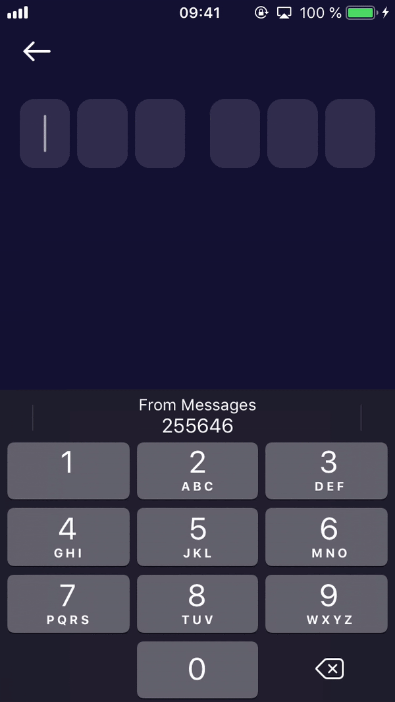

# OTPSwiftView


A fully customizable OTP view.

<p align="left">
  
</p> 

# Usage
```swift 
class ViewController: UIViewController {
    let otpView = CustomOTPSwiftView() // Custom OTP view

    let config = OTPCodeConfig(codeSymbolsCount: 6, // Base configuration of OTP view
                               spacing: 6,
                               customSpacing: [2: 20])

    override func viewDidLoad() {
        super.viewDidLoad()

        /* 
          Add your codeView and set layout 
        */
        
        /* Configure OTP view */
        
        otpView.configure(with: config)
        
        /* Bind events */
        
        otpView.onTextEnter = { code in
            // Get code from codeView
        }
        
        /* Update text */
        
        otpView.code = "234435"
        
        /* Update focus */
        
        otpView.focus = true|false
    }
}
```

# Customization 
## Single OTP View
*OTPView* is a base class that describes a single OTP textfield.  
To customize the appearance and layout, you must inherit from the OTPView.  
Don't forget to add UIGestureRecognizer to call closure `onTap?()`.
```swift
import OTPSwiftView

class CustomOTPView: OTPView {
    override func addViews() {
        super.addViews()
        
        // Adding additional views to current view. The OTP textfield has already been added.
    }
    
    override func configureLayout() {
        super.configureLayout()
    
        // Confgiure layout of subviews
    }
    
    override func bindViews() {
        super.bindViews()
        
        // Binding to data or user actions
    }
    
    override func configureAppearance() {
        super.configureAppearance()
        
        // Appearance configuration method
    }
}
```
## OTPSwiftView
*OTPSwiftView* is a base class that is responsible for the layout of single OTP views.  
As with OTPView, you should create an heir class to configure your full OTP view.
```swift
import OTPSwiftView

final class CustomOTPSwiftView: OTPSwiftView<CustomOTPView> {
    override func addViews() {
        super.addViews()
        
        // Adding additional views to current code view. The single OTP views has already been added.
    }
    
    override func configureLayout() {
        super.configureLayout()
        
        // Confgiure layout of subviews
    }
    
    override func bindViews() {
        super.bindViews()
        
        // Binding to data or user actions
    }
    
    override func configureAppearance() {
        super.configureAppearance()
        
        // Appearance configuration method
    }

    override func configure(with config: OTPCodeConfig) {
        super.configure(with: config)

        // Configure you code view with configuration
    }
}
```

# Installation via SPM

```swift
package.append(.package(url: "https://github.com/Loupehope/TICodeView.git", from: "0.0.3"))
```

# License

TICodeView is available under the Apache License 2.0. See the LICENSE file for more info.
